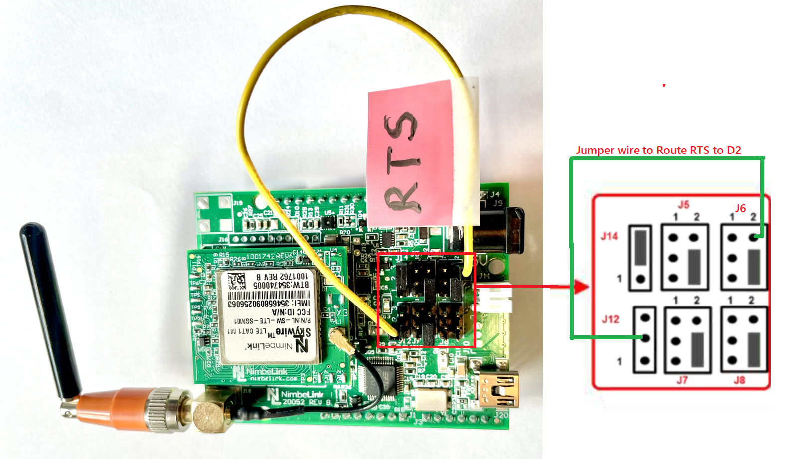
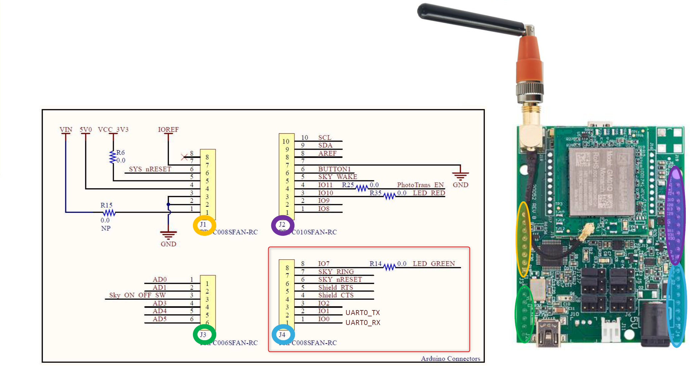
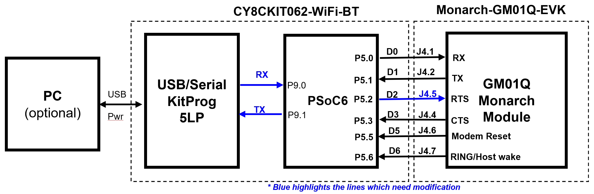
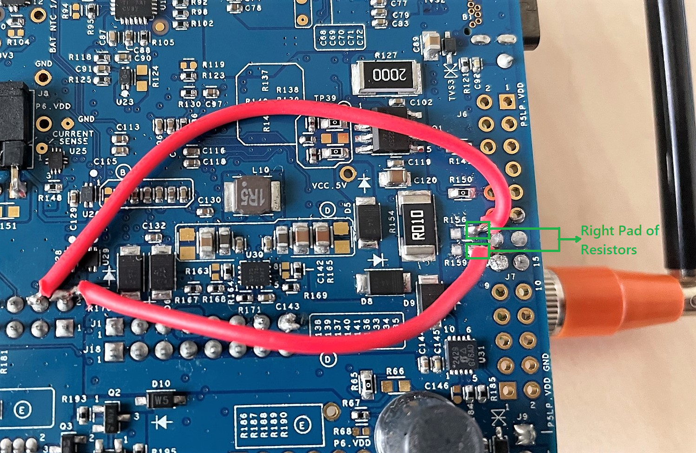
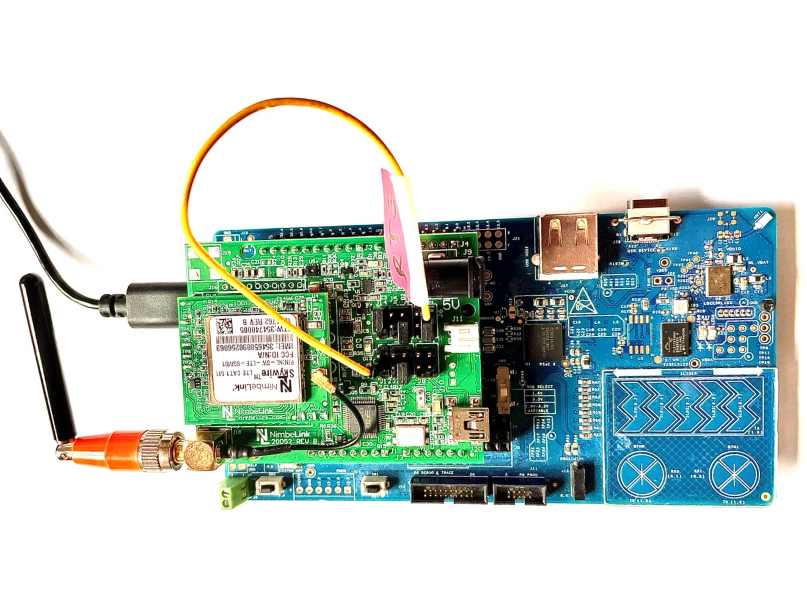
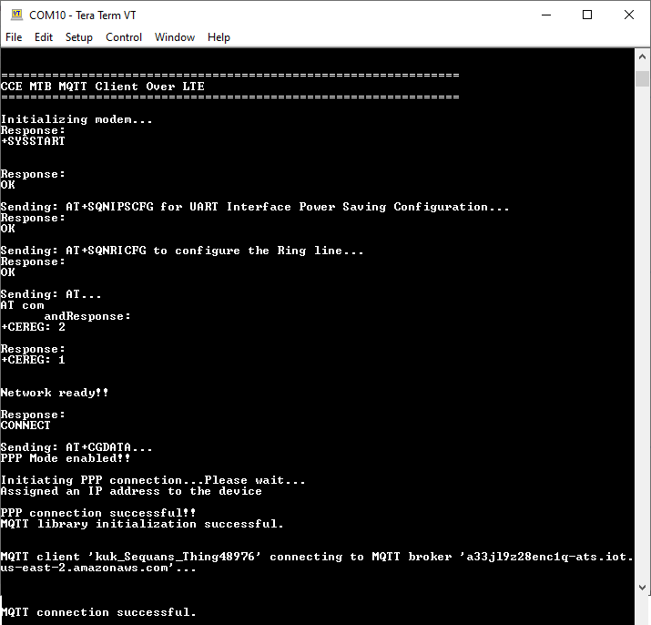

# MQTT Client Over LTE Cellular using GM01Q_Sequans Module

Disclaimer: This is a community code example (CCE) released for the benefit of the community users. These projects have only been tested for the listed BSPs, tools versions, and toolchains documented in this readme. They are intended to demonstrate how a solution / concept / use-case can be achieved on a particular device. For official code examples, please click [here](https://github.com/Infineon/Code-Examples-for-ModusToolbox-Software).

This community code example (CCE) demonstrates the implementation of LTE CAT M1 connectivity to PSoC6 via Point-to-Point Protocol (PPP). This CCE demonstrates the steps to add LTE connectivity to any existing Wi-Fi based code example. [mtb-example-anycloud-mqtt-client](https://github.com/Infineon/mtb-example-anycloud-mqtt-client) is taken as a reference here. [GM01Q_Sequans Module](https://www.sequans.com/products/monarch-gm01q/) is used for providing LTE connectivity for PSoC6 device. The MQTT Library and lwIP is hosted in PSoC6 and the GM01Q Module communicates to PSoC6 via PPP.

In order to test this sample you need [Monarch-GM01Q-EVK](https://www.sequans.com/products/monarch-gm01q-evk/) and one of the PSoC6 kits mentioned in [Supported kit section](#supported-kit).

**Sequence of Operation** 

1. On Power up, PSoC6 will send  commands to GM01Q_Sequans Module, initialize PPP and attach it to the LTE cellular Network.
   
2. Once the LTE connectivity is established, Application will establish MQTT connection to the broker and subscribe/publish to selected topics.

3. User can observe the messages on different stages of connectivity in Terminal.

4. The user button is pressed.

5. The GPIO interrupt service routine (ISR) notifies the publisher task.

6. The publisher task publishes a message on a topic.

7. The MQTT broker sends back the message to the MQTT client because it is also subscribed to the same topic.

8. When the message is received, the subscriber task turns the LED ON or OFF. As a result, the user LED toggles every time the user presses the button.

## Requirements

- [ModusToolbox&trade; software](https://www.Infineon.com/cms/en/design-support/tools/sdk/modustoolbox-software/) v2.4
- Board support package (BSP) minimum required version: 3.0.0
- Programming language: C
- Associated parts: All [PSoC&trade; 6 MCU](https://www.Infineon.com/cms/en/product/microcontroller/32-bit-psoc-arm-cortex-microcontroller/psoc-6-32-bit-arm-cortex-m4-mcu/) with [AIROC™ CYW43xxx Wi-Fi & Bluetooth® combo chips](https://www.Infineon.com/cms/en/product/wireless-connectivity/airoc-wi-fi-plus-bluetooth-combos/)

## Supported toolchains (make variable 'TOOLCHAIN')

- GNU Arm embedded compiler v9.3.1 (GCC_ARM) - Default value of `TOOLCHAIN`
- IAR C/C++ compiler v8.42.2 (IAR)
- Arm&reg; compiler v6.13 (`ARM`)

## Supported Kit
- [PSoC 6 WiFi-Bluetooth pioneer kit](https://www.Infineon.com/cms/en/product/evaluation-boards/cy8ckit-062-wifi-bt/) (`CY8CKIT-062-WiFi-BT`)

## Other kits 
- [PSoC 62S2 Wi-Fi Bluetooth® pioneer kit](https://www.Infineon.com/cms/en/product/evaluation-boards/cy8ckit-062s2-43012/) (`CY8CKIT-062S2-43012`)
- [PSoC 62S1 Wi-Fi Bluetooth pioneer kit](https://www.Infineon.com/cms/en/product/evaluation-boards/cyw9p62s1-43438evb-01/) (`CYW9P62S1-43438EVB-01`)
- [PSoC&trade; 62S1 Wi-Fi Bluetooth&reg; pioneer kit](https://www.Infineon.com/cms/en/product/evaluation-boards/cyw9p62s1-43012evb-01/) (`CYW9P62S1-43012EVB-01`)
- [PSoC 64 "Secure Boot" Wi-Fi Bluetooth pioneer kit](https://www.Infineon.com/cms/en/product/evaluation-boards/cy8ckit-064b0s2-4343w/) (`CY8CKIT-064B0S2-4343W`)
- [PSoC&trade; 62S2 evaluation kit](https://www.Infineon.com/cms/en/product/evaluation-boards/cy8ceval-062s2/) (`CY8CEVAL-062S2`, `CY8CEVAL-062S2-LAI-4373M2`, `CY8CEVAL-062S2-MUR-43439M2`)
- [PSoC&trade; 6 Wi-Fi Bluetooth&reg; prototyping kit](https://www.Infineon.com/CY8CPROTO-062-4343W) (`CY8CPROTO-062-4343W`)

## Hardware setup

 **[i. Monarch-GM01Q-EVK:](https://www.sequans.com/products/monarch-gm01q-evk/)** This kit is an Arduino Shield. This Evaluation Kit (EVK) enables out-of-the-box testing of Sequans’ Monarch GM01Q module on a LTE Cat M1 network. The EVK supports integration of the module with a host platform via a Mini USB or via UART pins in the Arduino header. Full documentation of this EVK can be found [here](https://cloud.sequans.com/apps/files/?dir=/GM01Q%20-%20Cat%20M1/GM01Q%20Evaluation%20Kit). In order to access the documentation, You must be registered at [https://cloud.sequans.com](https://cloud.sequans.com). 

 Make sure the sim card in the Sequans module is activated with required data plan. In some cases it might take longer for the sim to register/activate on the network, so it's a good idea to register/activate it well ahead. Before interfacing with PSoC6, you can follow the below manual and test  the LTE communication via AT commands in PC via Mini USB in the EVK.
- [Monarch-GM01Q-EVK quick start video](https://www.youtube.com/watch?v=wcE2E1SZCTA)
- [Monarch-GM01Q-EVK User manual](https://cloud.sequans.com/apps/files/?dir=/GM01Q%20-%20Cat%20M1/GM01Q%20Evaluation%20Kit&openfile=294449)
- [AT Commands reference manual:](https://cloud.sequans.com/apps/files/?dir=/GM01Q%20-%20Cat%20M1/Module&openfile=600837) This manual has details on testing the Monarch-GM01Q-EVK with AT commands.

The default jumper settings in Monarch-GM01Q-EVK is for USB to  PC connection. Re-arrange the jumpers as per the below picture for bringing UART (RX, TX, RTS and CTS) out to the Arduino header.

  
****Figure 1. Setting Jumpers for UART Connection of the Evaluation Kit****
	

****Figure 2. Monarch-GM01Q-EVK Pinouts****


**[ii. CY8CKIT-062-WiFi-BT:](https://www.Infineon.com/CY8CKIT-062-WiFi-BT)** . Place the Monarch-GM01Q-EVK Shield on the Arduino header of `CY8CKIT-062-WiFi-BT`. When the  Monarch-GM01Q-EVK Shield sits on `CY8CKIT-062-WiFi-BT`, Few pins get connected incorrectly. Pinouts in Block Diagram below is needed to establish proper hardware flow controlled UART communication between PSoC6 and LTE Modem. The CCE has been written for and tested on `CY8CKIT-062-WiFi-BT`. The hardware modifications can be easily translated to any of the [Other kits ](#other-kits ).


****Figure 3. Block Diagram****

 

### A. Hardware modifications in `CY8CKIT-062-WiFi-BT` to re-route Debug UART RX/TX to P9.0/P9.1
```
1. Remove resitors R156 and R159.
2. Wire right outer pad of R156 to J2-4 (P9.1).
3. Wire right outer pad of R159 to J2-2 (P9.0).
```

****Figure 4. Hardware modification to reroute UART RX and TX****

   

****Figure 5. Full Setup****

Connect the kit via kitprog USB to PC.

Before using this code example, make sure that the board is upgraded to KitProg3. The tool and instructions are available in the [Firmware Loader](https://github.com/Infineon/Firmware-loader) GitHub repository. If you do not upgrade, you will see an error like "unable to find CMSIS-DAP device" or "KitProg firmware is out of date".

## Software setup

Install a terminal emulator if you don't have one. Instructions in this document use [Tera Term](https://ttssh2.osdn.jp/index.html.en).

This code example implements a generic MQTT client that can connect to various MQTT brokers. In this document, the instructions to set up and run the MQTT client have been provided for the AWS IoT and Mosquitto MQTT brokers for reference. If you are using this code example with Mosquitto broker running locally on your PC, you need to download and install Mosquitto broker from https://mosquitto.org/download.

This example requires no additional software or tools if you are using the MQTT client with a publicly hosted MQTT broker.

## Using the code example

It is recommended to use a new workspace.
Create the project and open it using one of the following:


<details><summary><b>In Eclipse IDE for ModusToolbox&trade; software</b></summary>

1. Click the **New Application** link in the **Quick Panel** (or, use **File** > **New** > **ModusToolbox Application**). This launches the [Project Creator](https://www.Infineon.com/ModusToolboxProjectCreator) tool.

2. Pick a kit supported by the code example from the list shown in the **Project Creator - Choose Board Support Package (BSP)** dialog.

   When you select a supported kit, the example is reconfigured automatically to work with the kit. To work with a different supported kit later, use the [Library Manager](https://www.Infineon.com/ModusToolboxLibraryManager) to choose the BSP for the supported kit. You can use the Library Manager to select or update the BSP and firmware libraries used in this application. To access the Library Manager, click the link from the **Quick Panel**.

   You can also just start the application creation process again and select a different kit.

   If you want to use the application for a kit not listed here, you may need to update the source files. If the kit does not have the required resources, the application may not work.

3. In the **Project Creator - Select Application** dialog, choose the example by enabling the checkbox.

4. (Optional) Change the suggested **New Application Name**.

5. The **Application(s) Root Path** defaults to the Eclipse workspace which is usually the desired location for the application. If you want to store the application in a different location, you can change the *Application(s) Root Path* value. Applications that share libraries should be in the same root path.

6. Click **Create** to complete the application creation process.

For more details, see the [Eclipse IDE for ModusToolbox&trade; software user guide](https://www.Infineon.com/MTBEclipseIDEUserGuide) (locally available at *{ModusToolbox&trade; software install directory}/ide_{version}/docs/mt_ide_user_guide.pdf*).

</details>

<details><summary><b>In command-line interface (CLI)</b></summary>

ModusToolbox&trade; software provides the Project Creator as both a GUI tool and the command line tool, "project-creator-cli". The CLI tool can be used to create applications from a CLI terminal or from within batch files or shell scripts. This tool is available in the *{ModusToolbox&trade; software install directory}/tools_{version}/project-creator/* directory.

Use a CLI terminal to invoke the "project-creator-cli" tool. On Windows, use the command line "modus-shell" program provided in the ModusToolbox&trade; software installation instead of a standard Windows command-line application. This shell provides access to all ModusToolbox&trade; software tools. You can access it by typing `modus-shell` in the search box in the Windows menu. In Linux and macOS, you can use any terminal application.

This tool has the following arguments:

Argument | Description | Required/optional
---------|-------------|-----------
`--board-id` | Defined in the `<id>` field of the [BSP](https://github.com/Infineon?q=bsp-manifest&type=&language=&sort=) manifest | Required
`--app-id`   | Defined in the `<id>` field of the [CE](https://github.com/Infineon?q=ce-manifest&type=&language=&sort=) manifest | Required
`--target-dir`| Specify the directory in which the application is to be created if you prefer not to use the default current working directory | Optional
`--user-app-name`| Specify the name of the application if you prefer to have a name other than the example's default name | Optional

<br>

The following example will clone the "[Hello World](https://github.com/Infineon/mtb-example-psoc6-hello-world)" application with the desired name "MyHelloWorld" configured for the *CY8CKIT-062-WIFI-BT* BSP into the specified working directory, *C:/mtb_projects*:

   ```
   project-creator-cli --board-id CY8CKIT-062-WIFI-BT --app-id mtb-example-psoc6-hello-world --user-app-name MyHelloWorld --target-dir "C:/mtb_projects"
   ```

**Note:** The project-creator-cli tool uses the `git clone` and `make getlibs` commands to fetch the repository and import the required libraries. For details, see the "Project creator tools" section of the [ModusToolbox&trade; software user guide](https://www.Infineon.com/ModusToolboxUserGuide) (locally available at *{ModusToolbox&trade; software install directory}/docs_{version}/mtb_user_guide.pdf*).

</details>

<details><summary><b>In third-party IDEs</b></summary>

Use one of the following options:

- **Use the standalone [Project Creator](https://www.Infineon.com/ModusToolboxProjectCreator) tool:**

   1. Launch Project Creator from the Windows Start menu or from *{ModusToolbox&trade; software install directory}/tools_{version}/project-creator/project-creator.exe*.

   2. In the initial **Choose Board Support Package** screen, select the BSP, and click **Next**.

   3. In the **Select Application** screen, select the appropriate IDE from the **Target IDE** drop-down menu.

   4. Click **Create** and follow the instructions printed in the bottom pane to import or open the exported project in the respective IDE.

<br>

- **Use command-line interface (CLI):**

   1. Follow the instructions from the **In command-line interface (CLI)** section to create the application, and then import the libraries using the `make getlibs` command.

   2. Export the application to a supported IDE using the `make <ide>` command.

   3. Follow the instructions displayed in the terminal to create or import the application as an IDE project.

For a list of supported IDEs and more details, see the "Exporting to IDEs" section of the [ModusToolbox&trade; software user guide](https://www.Infineon.com/ModusToolboxUserGuide) (locally available at *{ModusToolbox&trade; software install directory}/docs_{version}/mtb_user_guide.pdf*).

</details>

## Operation

1. Connect the board to your PC using the provided USB cable through the KitProg3 USB connector.

2. Modify the user configuration files in the *configs* directory as follows:

      1. **MQTT configuration:** Set up the MQTT client and configure the credentials in *configs/mqtt_client_config.h*. Some of the important configuration macros are as follows:

         - `MQTT_BROKER_ADDRESS`: Hostname of the MQTT broker

         - `MQTT_PORT`: Port number to be used for the MQTT connection. As specified by IANA (Internet Assigned Numbers Authority), port numbers assigned for MQTT protocol are *1883* for non-secure connections and *8883* for secure connections. However, MQTT brokers may use other ports. Configure this macro as specified by the MQTT broker.

         - `MQTT_SECURE_CONNECTION`: Set this macro to `1` if a secure (TLS) connection to the MQTT broker is required to be established; else `0`.

         - `MQTT_USERNAME` and `MQTT_PASSWORD`: User name and password for client authentication and authorization, if required by the MQTT broker. However, note that this information is generally not encrypted and the password is sent in plain text. Therefore, this is not a recommended method of client authentication.

         - `CLIENT_CERTIFICATE` and `CLIENT_PRIVATE_KEY`: Certificate and private key of the MQTT client used for client authentication. Note that these macros are applicable only when `MQTT_SECURE_CONNECTION` is set to `1`.

         - `ROOT_CA_CERTIFICATE`: Root CA certificate of the MQTT broker

         See [Setting up the MQTT broker](#setting-up-the-mqtt-broker) to learn how to configure these macros for AWS IoT and Mosquitto MQTT brokers.

         For a full list of configuration macros used in this code example, see [MQTT configuration macros](#mqtt-configuration-macros).

      2. Other configuration files: You can optionally modify the configuration macros in the following files according to your application:

         - *configs/core_mqtt_config.h* used by the [MQTT library](https://github.com/Infineon/mqtt)

         - *configs/FreeRTOSConfig.h* used by the [FreeRTOS library](https://github.com/Infineon/freertos)

3. Open a terminal program and select the KitProg3 COM port. Set the serial port parameters to 8N1 and 115200 baud.

4. Program the board using one of the following:

   <details><summary><b>Using Eclipse IDE for ModusToolbox&trade; software</b></summary>

      1. Select the application project in the Project Explorer.

      2. In the **Quick Panel**, scroll down, and click **\<Application Name> Program (KitProg3_MiniProg4)**.
   </details>

   <details><summary><b>Using CLI</b></summary>

     From the terminal, execute the `make program` command to build and program the application using the default toolchain to the default target. The default toolchain and target are specified in the application's Makefile but you can override those values manually:
      ```
      make program TARGET=<BSP> TOOLCHAIN=<toolchain>
      ```

      Example:
      ```
      make program TARGET=CY8CKIT-062-WiFi-BT TOOLCHAIN=GCC_ARM
      ```
   </details>

5. After programming, The application starts automatically. PSoC6 will send commands to LTE Modem to Initialize PPP and attach it to cellular network. After Sending AT+CEREG, the application will wait to join the LTE network. Depending upon the cellular connectivity signal in your area, It may take a few seconds to mins to establish the network connection. After the "Network ready!!" message, Wait for the device to make MQTT connections to the broker.

   **Figure 6. Application initialization status**

   

6. Once the initialization is complete, confirm that the message *"Press the user button (SW2) to publish "TURN ON"/"TURN OFF" on the topic 'ledstatus'..."* is printed on the UART terminal. This message may vary depending on the MQTT topic and publish messages that are configured in the *mqtt_client_config.h* file.

7.. Press the user button (SW2) on the kit to toggle the LED state.

8. Confirm that the user LED state is toggled and the messages received on the subscribed topic are printed on the UART terminal.

   **Figure 7. Publisher and subscriber logs**

   

This example can be programmed on multiple kits (*only when `GENERATE_UNIQUE_CLIENT_ID` is set to `1`*); the user LEDs on all the kits will synchronously toggle with button presses on any kit.

Alternatively, the publish and subscribe functionalities of the MQTT client can be individually verified if the MQTT broker supports a test MQTT client like the AWS IoT.

- *To verify the subscribe functionality*: Using the test MQTT client, publish messages such as "TURN ON" and "TURN OFF" on the topic specified by the `MQTT_PUB_TOPIC` macro in *mqtt_client_config.h* to control the LED state on the kit.

- *To verify the publish functionality*: From the Test MQTT client, subscribe to the MQTT topic specified by the `MQTT_SUB_TOPIC` macro and confirm that the messages published by the kit (when the user button is pressed) are displayed on the test MQTT client's console.


## Debugging


You can debug the example to step through the code. In the IDE, use the **\<Application Name> Debug (KitProg3_MiniProg4)** configuration in the **Quick Panel**. For details, see the "Program and debug" section in the [Eclipse IDE for ModusToolbox&trade; software user guide](https://www.Infineon.com/MTBEclipseIDEUserGuide).

**Note:** **(Only while debugging)** On the CM4 CPU, some code in `main()` may execute before the debugger halts at the beginning of `main()`. This means that some code executes twice – once before the debugger stops execution, and again after the debugger resets the program counter to the beginning of `main()`. See [KBA231071](https://community.Infineon.com/docs/DOC-21143) to learn about this and for the workaround.


## Design and implementation

This example implements three RTOS tasks: MQTT client, publisher, and subscriber. The main function initializes the BSP and the retarget-io library, and creates the MQTT client task.

The MQTT client task initializes the PPP Manager and establishes connection to LTE cellular network. Upon a successful LTE connection, the task initializes the MQTT library and establishes a connection with the MQTT broker/server.

You can read [this documentation](https://cloud.sequans.com/apps/files/?dir=/GM01Q%20-%20Cat%20M1/Module&openfile=600837) to understand the details of PPP communication in GM01Q_Sequans Module.

The MQTT connection is configured to be secure by default; the secure connection requires a client certificate, a private key, and the Root CA certificate of the MQTT broker that are configured in *mqtt_client_config.h*.

After a successful MQTT connection, the subscriber and publisher tasks are created. The MQTT client task then waits for commands from the other two tasks and callbacks to handle events like unexpected disconnections.

The subscriber task initializes the user LED GPIO and subscribes to messages on the topic specified by the `MQTT_SUB_TOPIC` macro that can be configured in *mqtt_client_config.h*. When the subscriber task receives a message from the broker, it turns the user LED ON or OFF depending on whether the received message is "TURN ON" or "TURN OFF" (configured using the `MQTT_DEVICE_ON_MESSAGE` and `MQTT_DEVICE_OFF_MESSAGE` macros).

The publisher task sets up the user button GPIO and configures an interrupt for the button. The ISR notifies the Publisher task upon a button press. The publisher task then publishes messages (*TURN ON* / *TURN OFF*) on the topic specified by the `MQTT_PUB_TOPIC` macro. When the publish operation fails, a message is sent over a queue to the MQTT client task.

An MQTT event callback function `mqtt_event_callback()` invoked by the MQTT library for events like MQTT disconnection and incoming MQTT subscription messages from the MQTT broker. In the case of an MQTT disconnection, the MQTT client task is informed about the disconnection using a message queue. When an MQTT subscription message is received, the subscriber callback function implemented in *subscriber_task.c* is invoked to handle the incoming MQTT message.

The MQTT client task handles unexpected disconnections in the MQTT or LTE connections by initiating reconnection to restore the LTE and/or MQTT connections. Upon failure, the publisher and subscriber tasks are deleted, cleanup operations of various libraries are performed, and then the MQTT client task is terminated.


## Configuring the MQTT client

#### MQTT configuration macros

 Macro                               |  Description
 :---------------------------------- | :------------------------
 **MQTT Connection Configurations**  |  In *configs/mqtt_client_config.h*
 `MQTT_BROKER_ADDRESS`      | Hostname of the MQTT broker
 `MQTT_PORT`                | Port number to be used for the MQTT connection. As specified by IANA, port numbers assigned for MQTT protocol are *1883* for non-secure connections and *8883* for secure connections. However, MQTT brokers may use other ports. Configure this macro as specified by the MQTT broker.
 `MQTT_SECURE_CONNECTION`   | Set this macro to `1` if a secure (TLS) connection to the MQTT broker is required to be established; else `0`.
 `MQTT_USERNAME` <br> `MQTT_PASSWORD`   | User name and password for client authentication and authorization, if required by the MQTT broker. However, note that this information is generally not encrypted and the password is sent in plain text. Therefore, this is not a recommended method of client authentication.
 **MQTT Client Certificate Configurations**  |  In *configs/mqtt_client_config.h*
 `CLIENT_CERTIFICATE` <br> `CLIENT_PRIVATE_KEY`  | Certificate and private key of the MQTT client used for client authentication. Note that these macros are applicable only when `MQTT_SECURE_CONNECTION` is set to `1`.
 `ROOT_CA_CERTIFICATE`      |  Root CA certificate of the MQTT broker
 **MQTT Message Configurations**    |  In *configs/mqtt_client_config.h*
 `MQTT_PUB_TOPIC`           | MQTT topic to which the messages are published by the Publisher task to the MQTT broker
 `MQTT_SUB_TOPIC`           | MQTT topic to which the subscriber task subscribes to. The MQTT broker sends the messages to the subscriber that are published in this topic (or equivalent topic).
 `MQTT_MESSAGES_QOS`        | The Quality of Service (QoS) level to be used by the publisher and subscriber. Valid choices are `0`, `1`, and `2`.
 `ENABLE_LWT_MESSAGE`       | Set this macro to `1` if you want to use the 'Last Will and Testament (LWT)' option; else `0`. LWT is an MQTT message that will be published by the MQTT broker on the specified topic if the MQTT connection is unexpectedly closed. This configuration is sent to the MQTT broker during MQTT connect operation; the MQTT broker will publish the Will message on the Will topic when it recognizes an unexpected disconnection from the client.
 `MQTT_WILL_TOPIC_NAME` <br> `MQTT_WILL_MESSAGE`   | The MQTT topic and message for the LWT option described above. These configurations are applicable only when `ENABLE_LWT_MESSAGE` is set to `1`.
 `MQTT_DEVICE_ON_MESSAGE` <br> `MQTT_DEVICE_OFF_MESSAGE`  | The MQTT messages that control the device (LED) state in this code example.
 **Other MQTT Client Configurations**    |  In *configs/mqtt_client_config.h*
 `GENERATE_UNIQUE_CLIENT_ID`   | Every active MQTT connection must have a unique client identifier. If this macro is set to `1`, the device will generate a unique client identifier by appending a timestamp to the string specified by the `MQTT_CLIENT_IDENTIFIER` macro. This feature is useful if you are using the same code on multiple kits simultaneously.
 `MQTT_CLIENT_IDENTIFIER`     | The client identifier (client ID) string to be used during MQTT connection. If `GENERATE_UNIQUE_CLIENT_ID` is set to `1`, a timestamp is appended to this macro value and used as the client ID; else, the value specified for this macro is directly used as the client ID.
 `MQTT_CLIENT_IDENTIFIER_MAX_LEN`   | The longest client identifier that an MQTT server must accept (as defined by the MQTT 3.1.1 spec) is 23 characters. However, some MQTT brokers support longer client IDs. Configure this macro as per the MQTT broker specification.
 `MQTT_TIMEOUT_MS`            | Timeout in milliseconds for MQTT operations in this example
 `MQTT_KEEP_ALIVE_SECONDS`    | The keepalive interval in seconds used for MQTT ping request
 `MQTT_ALPN_PROTOCOL_NAME`   | The application layer protocol negotiation (ALPN) protocol name to be used that is supported by the MQTT broker in use. Note that this is an optional macro for most of the use cases. <br>Per IANA, the port numbers assigned for MQTT protocol are 1883 for non-secure connections and 8883 for secure connections. In some cases, there is a need to use other ports for MQTT like port 443 (which is reserved for HTTPS). ALPN is an extension to TLS that allows many protocols to be used over a secure connection.
 `MQTT_SNI_HOSTNAME`   | The server name indication (SNI) host name to be used during the transport layer security (TLS) connection as specified by the MQTT broker. <br>SNI is extension to the TLS protocol. As required by some MQTT brokers, SNI typically includes the hostname in the "Client Hello" message sent during TLS handshake.
 `MQTT_NETWORK_BUFFER_SIZE`   | A network buffer is allocated for sending and receiving MQTT packets over the network. Specify the size of this buffer using this macro. Note that the minimum buffer size is defined by the `CY_MQTT_MIN_NETWORK_BUFFER_SIZE` macro in the MQTT library.
 `MAX_MQTT_CONN_RETRIES`   | Maximum number of retries for MQTT connection
 `MQTT_CONN_RETRY_INTERVAL_MS`   | Time interval in milliseconds in between successive MQTT connection retries

<br>

#### Setting up the MQTT broker

<details><summary><b>AWS IoT MQTT</b></summary>

 1. Set up the MQTT device (also known as a *Thing*) in the AWS IoT core as described in the [Getting started with AWS IoT tutorial](https://docs.aws.amazon.com/iot/latest/developerguide/iot-gs.html).

    **Note:** While setting up your device, ensure that the policy associated with this device permits all MQTT operations (*iot:Connect*, *iot:Publish*, *iot:Receive*, and *iot:Subscribe*) for the resource used by this device. For testing purposes, it is recommended to have the following policy document which allows all *MQTT Policy Actions* on all *Amazon Resource Names (ARNs)*.
    ```
    {
        "Version": "2012-10-17",
        "Statement": [
            {
                "Effect": "Allow",
                "Action": "iot:*",
                "Resource": "*"
            }
        ]
    }
    ```

 2. In the *configs/mqtt_client_config.h* file, set `MQTT_BROKER_ADDRESS` to your custom endpoint on the **Settings** page of the AWS IoT console. This has the format `ABCDEFG1234567.iot.<region>.amazonaws.com`.

 3. Set the macros `MQTT_PORT` to `8883` and `MQTT_SECURE_CONNECTION` to `1` in the *configs/mqtt_client_config.h* file.

 4. Download the following certificates and keys that are created and activated in the previous step:

       - A certificate for the AWS IoT Thing - *xxxxxxxxxx.cert.pem*
       - A public key - *xxxxxxxxxx.public.key*
       - A private key - *xxxxxxxxxx.private.key*
       - Root CA "RSA 2048 bit key: Amazon Root CA 1" for AWS IoT from [CA certificates for server authentication](https://docs.aws.amazon.com/iot/latest/developerguide/server-authentication.html#server-authentication-certs).

 5. Using these certificates and keys, enter the following parameters in *mqtt_client_config.h* in Privacy-Enhanced Mail (PEM) format:
       - `CLIENT_CERTIFICATE` - *xxxxxxxxxx.cert.pem*
       - `CLIENT_PRIVATE_KEY` - *xxxxxxxxxx.private.key*
       - `ROOT_CA_CERTIFICATE` - Root CA certificate

    You can either convert the values to strings manually following the format shown in *mqtt_client_config.h* or you can use the HTML utility available [here](https://github.com/Infineon/amazon-freertos/blob/master/tools/certificate_configuration/PEMfileToCString.html) to convert the certificates and keys from PEM format to C string format. You need to clone the repository from GitHub to use the utility.

</details>

<details><summary><b>Local Mosquitto broker</b></summary>

Download and install the Mosquitto broker for your PC from https://mosquitto.org/download. The following instructions help in setting up the Mosquitto broker for a secure connection with the client using self-signed SSL certificates. This requires **OpenSSL** which is already preloaded in the ModusToolbox&trade; software installation. Run the following commands with a CLI (on Windows, use the command line "modus-shell" program provided in the ModusToolbox&trade; software installation instead of the standard Windows command-line application).

1. Generate the CA certificate for the Mosquitto broker / server using the following commands. Follow the instructions in the command window to provide the details required.
   ```
   openssl genrsa -out ca.key 2048
   openssl req -new -x509 -sha256 -nodes -days 365 -key ca.key -out ca.crt
   ```

2. Generate the server key pair and server certificate (signed using the CA certificate from Step 1) for the Mosquitto broker using the following commands. Follow the instructions in the command window to provide the details required.
   ```
   openssl genrsa -out server.key 2048
   openssl req -new -nodes -sha256 -key server.key -out server.csr
   openssl x509 -req -sha256 -in server.csr -CA ca.crt -CAkey ca.key -CAcreateserial -out server.crt -days 365
   ```

   At this stage, the certificates and keys required by the Mosquitto broker are ready. The files used from these steps are *ca.crt*, *server.crt*, and *server.key*.

3. Create a configuration file for the Mosquitto Broker - *mosquitto.conf* with the following contents and provide the path to the generated credentials (*ca.crt*, *server.crt*, and *server.key*) under the *SSL settings* section.
    ```
   # Config file for mosquitto
   connection_messages true
   per_listener_settings true
   listener 8883
   require_certificate true
   use_identity_as_username true
   allow_anonymous false
   cafile <path-to-ca.crt>
   keyfile <path-to-server.key>
   certfile <path-to-server.crt>
   ```

4. Start the Mosquitto broker with the configurations from the above *mosquitto.conf* file using the following command. If the *mosquitto.conf* file is present in a different location from where the command is run, provide the path to the config file after the `-c` argument.
   ```
   mosquitto -v -c mosquitto.conf
   ```

5. Generate the client certificates using the following commands. Follow the instructions in the command window to provide the details required. Note that the last command requires *ca.crt* and *ca.key* files generated in Step 2.
   ```
   openssl genrsa -out client.key 2048
   openssl req -new -out client.csr -key client.key
   openssl x509 -req -in client.csr -CA ca.crt -CAkey ca.key -CA create serial -out client.crt -days 365
   ```

6. Configure the MQTT client configurations in *configs/mqtt_client_config.h* as follows:

     - `MQTT_BROKER_ADDRESS` as the IP address of the PC running the Mosquitto broker (the PC on which Step 4 is performed).

     - `MQTT_PORT` as `8883`.

     - `MQTT_SECURE_CONNECTION` as `1`.

     - Using the client certificate (*client.crt*), private key (*client.key*), and root CA certificate (*ca.crt*) from the above steps, configure the `CLIENT_CERTIFICATE`, `CLIENT_PRIVATE_KEY`, and `ROOT_CA_CERTIFICATE` macros respectively.

       You can either convert the PEM format values to strings manually following the format shown in *mqtt_client_config.h* or you can use the HTML utility available [here](https://github.com/Infineon/amazon-freertos/blob/master/tools/certificate_configuration/PEMfileToCString.html) to convert the certificates and keys from PEM format to C string format. You need to clone the repository from GitHub to use the utility.

</details>

Although this section provides instructions only for AWS IoT and the local Mosquitto broker, the MQTT client implemented in this example is generic. It is expected to work with other MQTT brokers with appropriate configurations. See the [list of publicly-accessible MQTT brokers](https://github.com/mqtt/mqtt.github.io/wiki/public_brokers) that can be used for testing and prototyping purposes.


### Resources and settings

**Table 1. Application resources**

 Resource  |  Alias/object     |    Purpose
 :------- | :------------    | :------------
 UART (HAL)    |cy_retarget_io_uart_obj| UART HAL object used by Retarget-IO for Debug UART port
 UART (HAL)    |uart_modem_obj| UART HAL object used for communicating with LTE Modem
 GPIO (HAL)    | UART_MODEM_RESET       | User GPIO used to reset LTE Modem 
 GPIO (HAL)    | CYBSP_USER_LED         | User LED controlled by the subscriber based on incoming MQTT messages
 GPIO (HAL)    | CYBSP_USER_BTN         | User button used to notify the publisher to publish MQTT messages

<br>

## Build issues.
If you face any build issues pointing to Wi-Fi related libraries, Delete the below Wi-Fi related library folders and trying building the application again.
```
mtb_shared/wifi-connection-manager
mtb_shared/wifi-host-driver
mtb_shared/whd-bsp-integration
mtb_shared/wpa3-external-supplicant
mtb_shared/wifi-core-freertos-lwip-mbedtls
mtb_shared/connectivity-utilities
mtb_shared/wifi-mw-core/
mtb_shared/lwip-network-interface-integration
mtb_shared/secure-sockets
mtb_shared/lwip-freertos-integration
```


## How to replace Wi-Fi with LTE Cellular in any other example.

1. Create a new  connectivity application of you interest with Wi-Fi as connectivy option. Generate, build and test it as per your requirements. Let us call this `new-mtb-application`.

2. Include `ppp_modem_defines.h` file from `source` folder of `cce-mtb-mqtt-client-over-lte` to `source` folder of `new-mtb-application`.

3. Define the pinouts of LTE Modem and Debug UART in `ppp_modem_defines.h`. Example from `cce-mtb-mqtt-client-over-lte`is below. This pinouts should match the hardware modification done to connect LTE modem to PSoC6. see [Hardware Setup](#hardware-setup) for more details.

```
/* Debug UART Pins */
#define UART_HMI_RX P9_0
#define UART_HMI_TX P9_1

/* LTE Modem UART Pins */
#define UART_MODEM_RX P5_0
#define UART_MODEM_TX P5_1
#define UART_MODEM_RTS P5_2
#define UART_MODEM_CTS	P5_3
#define UART_MODEM_RESET P5_5
/* Wake Up pin */
#define PSOC_WAKE_UP P5_6
```
4. Delete `libs` folder in your `new-mtb-application`and Copy over the contents of `deps` folder from `cce-mtb-mqtt-client-over-lte` to `deps` folder of your `new-mtb-application`.

5. Delete all the Wi-Fi related `*.mtb`files  from `deps` folder in your `new-mtb-application`. An example of  Wi-Fi related `*.mtb` file is below

```
wifi-connection-manager.mtb
```

6. From `cce-mtb-mqtt-client-over-lte ` project copy over the `libs_lte` to the root of your `new-mtb-application`. This folder has cellular library files. 

7. In  the `makefile` of `new-mtb-application' find the below lines and replace `CYBSP_WIFI_CAPABLE` with `CYBSP_PPP_CAPABLE`.

```
# Add additional defines to the build process (without a leading -D).
DEFINES=$(MBEDTLSFLAGS) CYBSP_WIFI_CAPABLE CY_RETARGET_IO_CONVERT_LF_TO_CRLF 
```

8. Find the below lines in `makefile` of `new-mtb-application`
```
# Absolute path to the compiler's "bin" directory.
#
# The default depends on the selected TOOLCHAIN (GCC_ARM uses the ModusToolbox
# IDE provided compiler by default).
CY_COMPILER_PATH=
```
Edit it to match the below. By doing this we are directing the compiler to exclude the Wi-Fi related resources in mtb_shared libraries from getting built.
```
# Absolute path to the compiler's "bin" directory.
#
# The default depends on the selected TOOLCHAIN (GCC_ARM uses the ModusToolbox
# IDE provided compiler by default).
CY_COMPILER_PATH=

CY_IGNORE+=../mtb_shared/wifi-connection-manager
CY_IGNORE+=../mtb_shared/wifi-host-driver
CY_IGNORE+=../mtb_shared/whd-bsp-integration
CY_IGNORE+=../mtb_shared/wpa3-external-supplicant
CY_IGNORE+=../mtb_shared/wifi-core-freertos-lwip-mbedtls
CY_IGNORE+=../mtb_shared/connectivity-utilities
CY_IGNORE+=../mtb_shared/wifi-mw-core/release-v3.4.0/lwip-whd-port
# issue with ignoring .cyignore in wifi bundle
CY_IGNORE+=../mtb_shared/lwip-network-interface-integration/release-v1.0.0
CY_IGNORE+=../mtb_shared/secure-sockets/release-v2.5.0
CY_IGNORE+=../mtb_shared/lwip-network-interface-integration/release-v1/doxygen
CY_IGNORE+=../mtb_shared/lwip-network-interface-integration/release-v1/test
CY_IGNORE+=../mtb_shared/secure-sockets/release-v3/doxygen
CY_IGNORE+=../mtb_shared/secure-sockets/release-v3/test
```
9. Build your project, program and verify.


## Related resources


Resources  | Links
-----------|----------------------------------
Application notes  | [AN228571](https://www.Infineon.com/AN228571) – Getting started with PSoC&trade; 6 MCU on ModusToolbox&trade; software <br>  [AN215656](https://www.Infineon.com/AN215656) – PSoC&trade; 6 MCU: Dual-CPU system design
Code examples  | [Using ModusToolbox&trade; software](https://github.com/Infineon/Code-Examples-for-ModusToolbox-Software) on GitHub
Device documentation | [PSoC&trade; 6 MCU datasheets](https://www.Infineon.com/search/all?f[0]=meta_type%3Atechnical_documents&f[1]=resource_meta_type%3A575&f[2]=field_related_products%3A114026) <br> [PSoC&trade; 6 technical reference manuals](https://www.Infineon.com/search/all/PSoC%206%20Technical%20Reference%20Manual?f[0]=meta_type%3Atechnical_documents&f[1]=resource_meta_type%3A583)
Development kits | Visit www.Infineon.com/microcontrollers-mcus-kits and use the options in the **Select your kit** section to filter kits by *Product family* or *Features*.
Libraries on GitHub  | [mtb-pdl-cat1](https://github.com/Infineon/mtb-pdl-cat1) – PSoC&trade; 6 peripheral driver library (PDL)  <br> [mtb-hal-cat1](https://github.com/Infineon/mtb-hal-cat1) – Hardware abstraction layer (HAL) library <br> [retarget-io](https://github.com/Infineon/retarget-io) – Utility library to retarget STDIO messages to a UART port
Middleware on GitHub | [mqtt](https://github.com/Infineon/mqtt) – MQTT client library and documents <br>[freeRTOS](https://github.com/Infineon/freertos) – FreeRTOS library and documents <br> [capsense](https://github.com/Infineon/capsense) – CAPSENSE&trade; library and documents <br> [psoc6-middleware](https://github.com/Infineon/modustoolbox-software#psoc-6-middleware-libraries) – Links to all PSoC&trade; 6 MCU middleware
Tools  | [Eclipse IDE for ModusToolbox&trade; software](https://www.Infineon.com/modustoolbox) – ModusToolbox&trade; software is a collection of easy-to-use software and tools enabling rapid development with Infineon MCUs, covering applications from embedded sense and control to wireless and cloud-connected systems using AIROC&trade; Wi-Fi and Bluetooth® connectivity devices.

<br>

## Other resources


Infineon provides a wealth of data at www.Infineon.com to help you select the right device, and quickly and effectively integrate it into your design.

For PSoC&trade; 6 MCU devices, see [How to design with PSoC&trade; 6 MCU - KBA223067](https://community.Infineon.com/docs/DOC-14644) in the Infineon community.


## Document history

Document title: *CCE236075* - *mtb-mqtt-client-over-lte*

 Version | Description of change
 ------- | ---------------------
 1.0.0   | New community code example
 1.0.1   | Minor edit in dependency
 

<br>

---------------------------------------------------------

© Cypress Semiconductor Corporation, 2020-2022. This document is the property of Cypress Semiconductor Corporation, an Infineon Technologies company, and its affiliates ("Cypress").  This document, including any software or firmware included or referenced in this document ("Software"), is owned by Cypress under the intellectual property laws and treaties of the United States and other countries worldwide.  Cypress reserves all rights under such laws and treaties and does not, except as specifically stated in this paragraph, grant any license under its patents, copyrights, trademarks, or other intellectual property rights.  If the Software is not accompanied by a license agreement and you do not otherwise have a written agreement with Cypress governing the use of the Software, then Cypress hereby grants you a personal, non-exclusive, nontransferable license (without the right to sublicense) (1) under its copyright rights in the Software (a) for Software provided in source code form, to modify and reproduce the Software solely for use with Cypress hardware products, only internally within your organization, and (b) to distribute the Software in binary code form externally to end users (either directly or indirectly through resellers and distributors), solely for use on Cypress hardware product units, and (2) under those claims of Cypress’s patents that are infringed by the Software (as provided by Cypress, unmodified) to make, use, distribute, and import the Software solely for use with Cypress hardware products.  Any other use, reproduction, modification, translation, or compilation of the Software is prohibited.
<br>
TO THE EXTENT PERMITTED BY APPLICABLE LAW, CYPRESS MAKES NO WARRANTY OF ANY KIND, EXPRESS OR IMPLIED, WITH REGARD TO THIS DOCUMENT OR ANY SOFTWARE OR ACCOMPANYING HARDWARE, INCLUDING, BUT NOT LIMITED TO, THE IMPLIED WARRANTIES OF MERCHANTABILITY AND FITNESS FOR A PARTICULAR PURPOSE.  No computing device can be absolutely secure.  Therefore, despite security measures implemented in Cypress hardware or software products, Cypress shall have no liability arising out of any security breach, such as unauthorized access to or use of a Cypress product. CYPRESS DOES NOT REPRESENT, WARRANT, OR GUARANTEE THAT CYPRESS PRODUCTS, OR SYSTEMS CREATED USING CYPRESS PRODUCTS, WILL BE FREE FROM CORRUPTION, ATTACK, VIRUSES, INTERFERENCE, HACKING, DATA LOSS OR THEFT, OR OTHER SECURITY INTRUSION (collectively, "Security Breach").  Cypress disclaims any liability relating to any Security Breach, and you shall and hereby do release Cypress from any claim, damage, or other liability arising from any Security Breach.  In addition, the products described in these materials may contain design defects or errors known as errata which may cause the product to deviate from published specifications. To the extent permitted by applicable law, Cypress reserves the right to make changes to this document without further notice. Cypress does not assume any liability arising out of the application or use of any product or circuit described in this document. Any information provided in this document, including any sample design information or programming code, is provided only for reference purposes.  It is the responsibility of the user of this document to properly design, program, and test the functionality and safety of any application made of this information and any resulting product.  "High-Risk Device" means any device or system whose failure could cause personal injury, death, or property damage.  Examples of High-Risk Devices are weapons, nuclear installations, surgical implants, and other medical devices.  "Critical Component" means any component of a High-Risk Device whose failure to perform can be reasonably expected to cause, directly or indirectly, the failure of the High-Risk Device, or to affect its safety or effectiveness.  Cypress is not liable, in whole or in part, and you shall and hereby do release Cypress from any claim, damage, or other liability arising from any use of a Cypress product as a Critical Component in a High-Risk Device. You shall indemnify and hold Cypress, including its affiliates, and its directors, officers, employees, agents, distributors, and assigns harmless from and against all claims, costs, damages, and expenses, arising out of any claim, including claims for product liability, personal injury or death, or property damage arising from any use of a Cypress product as a Critical Component in a High-Risk Device. Cypress products are not intended or authorized for use as a Critical Component in any High-Risk Device except to the limited extent that (i) Cypress’s published data sheet for the product explicitly states Cypress has qualified the product for use in a specific High-Risk Device, or (ii) Cypress has given you advance written authorization to use the product as a Critical Component in the specific High-Risk Device and you have signed a separate indemnification agreement.
<br>
Cypress, the Cypress logo, and combinations thereof, WICED, ModusToolbox, PSoC, CapSense, EZ-USB, F-RAM, and Traveo are trademarks or registered trademarks of Cypress or a subsidiary of Cypress in the United States or in other countries. For a more complete list of Cypress trademarks, visit Infineon.com. Other names and brands may be claimed as property of their respective owners.
